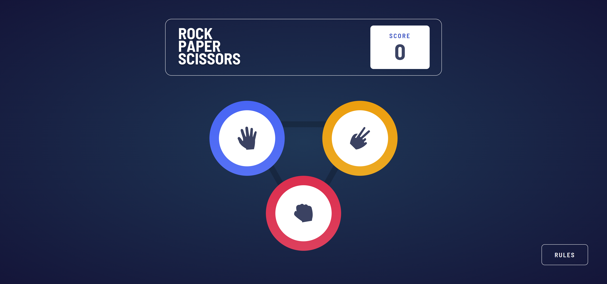
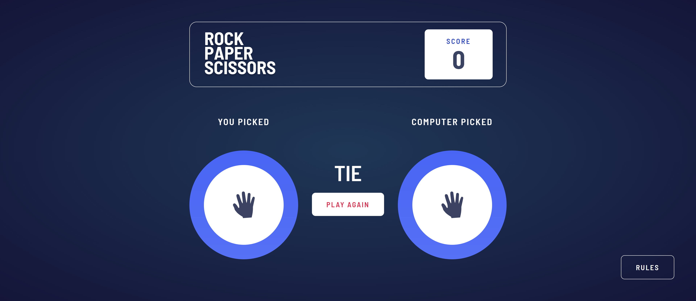
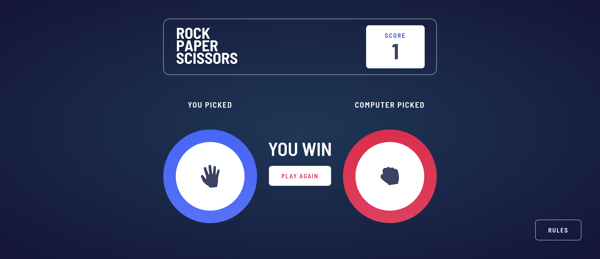
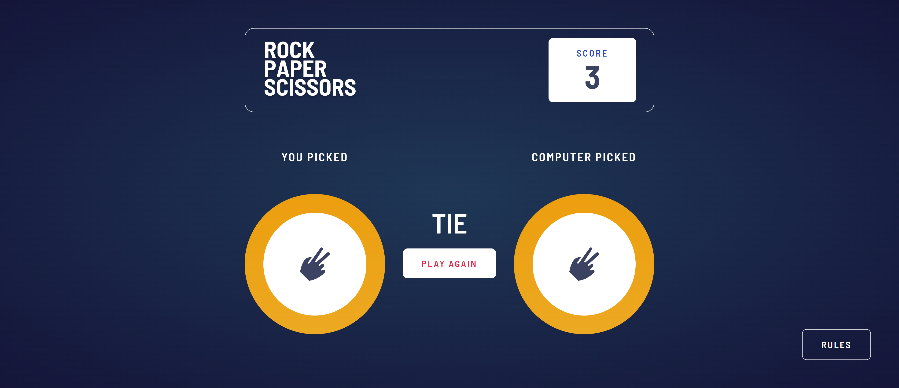
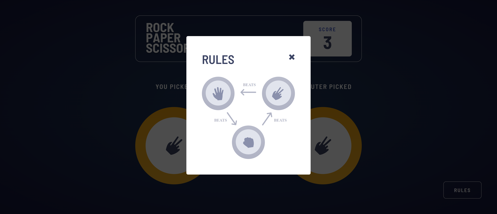

# Frontend Mentor - Rock, Paper, Scissors solution

This is a solution to the [Rock, Paper, Scissors challenge on Frontend Mentor](https://www.frontendmentor.io/challenges/rock-paper-scissors-game-pTgwgvgH). Frontend Mentor challenges help you improve your coding skills by building realistic projects.

## Table of contents

- [Frontend Mentor - Rock, Paper, Scissors solution](#frontend-mentor---rock-paper-scissors-solution)
  - [Table of contents](#table-of-contents)
  - [Overview](#overview)
    - [The challenge](#the-challenge)
    - [Screenshot](#screenshot)
    - [Links](#links)
  - [My process](#my-process)
    - [Built with](#built-with)
  - [Author](#author)

**Note: Delete this note and update the table of contents based on what sections you keep.**

## Overview

### The challenge

Users should be able to:

-   View the optimal layout for the game depending on their device's screen size
-   Play Rock, Paper, Scissors against the computer
-   Maintain the state of the score after refreshing the browser \_(optional)

### Screenshot

### Links

-   Solution URL: [GitHub](https://github.com/KaeserOfHonour/Frontend-Mentor-Rock-Paper-Scissors)
-   Live Site URL: [Netlify](https://frontend-mentor-smug-rock-paper-sciss.netlify.app)

## My process

### Built with

-   Semantic HTML5 markup
-   CSS custom properties
-   Flexbox
-   CSS Grid
-   [PostCSS](https://postcss.org/) - CSS tool to get future CSS and SASS features.

## Author

-   Frontend Mentor - [@KaeserOfHonour](https://www.frontendmentor.io/profile/KaeserOfHonour)
